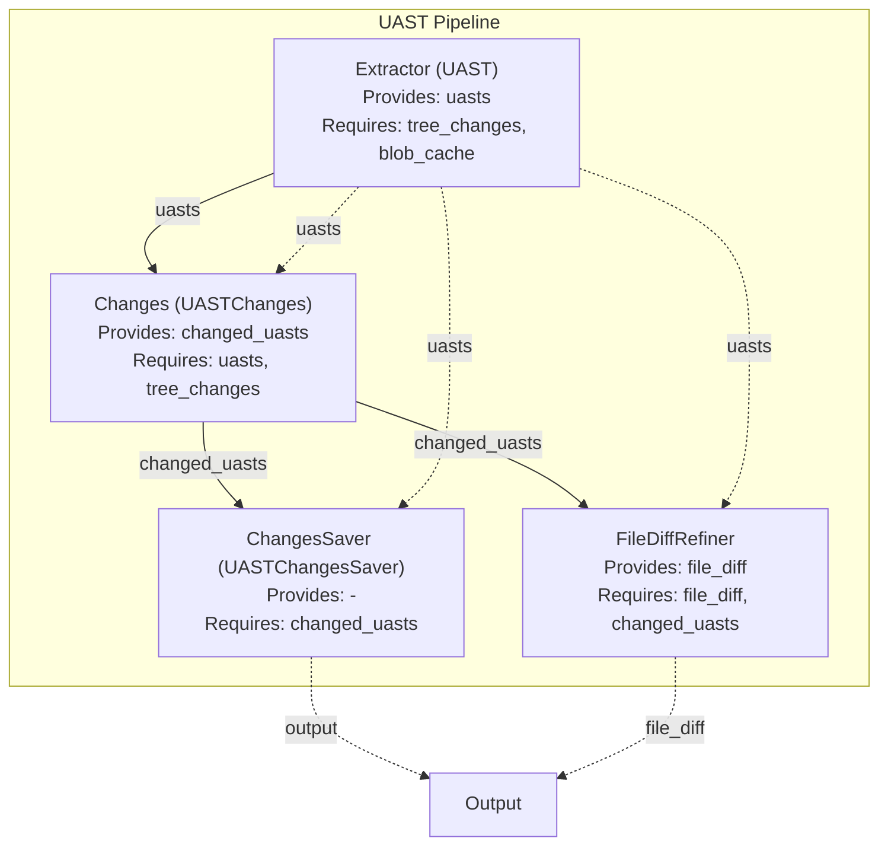

# Hercules Pipeline Modules & UAST Roadmap

## Pipeline Modules

### 1. Extractor (UAST)
- **Provides:** `uasts`
- **Requires:** `tree_changes`, `blob_cache`
- **Description:** Retrieves UASTs for changed files using Babelfish or embedded providers.

### 2. Changes (UASTChanges)
- **Provides:** `changed_uasts`
- **Requires:** `uasts`, `tree_changes`
- **Description:** Produces UASTs for every logical change in a commit.

### 3. ChangesSaver (UASTChangesSaver)
- **Provides:** _none_
- **Requires:** `changed_uasts`
- **Description:** Dumps changed files and corresponding UASTs to disk.

### 4. FileDiffRefiner
- **Provides:** `file_diff`
- **Requires:** `file_diff`, `changed_uasts`
- **Description:** Refines diffs using UASTs for better interpretability.

---

## Dependency Graph

---

## UAST/Embedded Provider Roadmap

### Completed
- [x] Integrate Tree-sitter-based embedded UAST provider
- [x] Robust conversion from Tree-sitter nodes to UAST nodes (iterative, safe)
- [x] Handle tree lifetime and node validity (no segfaults)
- [x] Type assertion and conversion logic for all node types
- [x] CLI integration for `--uast-provider=embedded`
- [x] Dependency documentation and graph

### In Progress
- [ ] Full pipeline validation logic (dependency graph, interface checks)
- [ ] Automated module validation at startup
- [ ] Documentation improvements

### Planned / Future
- [ ] Fuzz and stress testing for embedded UAST
- [ ] Benchmarking and performance optimization
- [ ] Support for more languages in embedded mode
- [ ] Improved error reporting and diagnostics
- [ ] User-facing documentation for UAST/embedded mode 